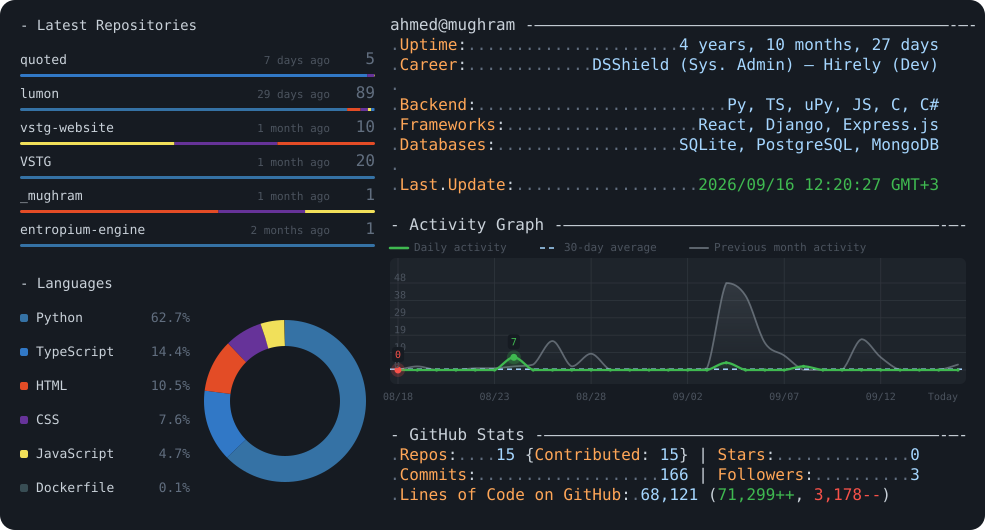

<picture>
  <source media="(prefers-color-scheme: dark)" srcset="dark_mode.svg">
  <source media="(prefers-color-scheme: light)" srcset="light_mode.svg">
  
</picture>

This card is generated by [`today.py`](today.py) on a schedule via [GitHub Actions](.github/workflows/build.yaml), pulling live stats from the GitHub GraphQL API and rendering them into the SVGs above.

Adapted from [Andrew6rant/Andrew6rant](https://github.com/Andrew6rant/Andrew6rant).
